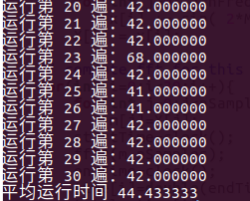
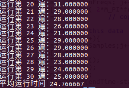
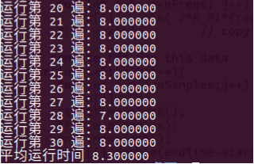
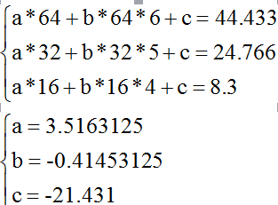

# 实验报告

## 实验实验名称（测量FFT程序执行时间）

智能1501 201508010513 王鑫淼

## 实验目标

测量FFT程序运行时间，确定其时间复杂度。

## 实验要求

* 采用C/C++编写程序
* 根据自己的机器配置选择合适的输入数据大小 n，至少要测试多个不同的 n (参见思考题)
* 对于相同的 n，建议重复测量30次取平均值作为测量结果 (参见思考题)
* 对测量结果进行分析，确定FFT程序的时间复杂度
* 回答思考题，答案加入到实验报告叙述中合适位置

## 思考题

1. 分析FFT程序的时间复杂度，得到执行时间相对于数据规模 n 的具体公式
2. 根据上一点中的分析，至少要测试多少不同的 n 来确定执行时间公式中的未知数？
3. 重复30次测量然后取平均有什么统计学的依据？

## 实验内容

### FFT算法代码

```c++
#include <complex>
#include <cstdio>
#include <ctime>

#define M_PI 3.14159265358979323846 // Pi constant with double precision
#define CLOCKS_PER_SEC ((clock_t)1000)
using namespace std;
// separate even/odd elements to lower/upper halves of array respectively.
// Due to Butterfly combinations, this turns out to be the simplest way 
// to get the job done without clobbering the wrong elements.
void separate (complex<double>* a, int n) {
    complex<double>* b = new complex<double>[n/2];   // get temp heap storage
    for(int i=0; i<n/2; i++)    // copy all odd elements to heap storage
        b[i] = a[i*2+1];
    for(int i=0; i<n/2; i++)    // copy all even elements to lower-half of a[]
        a[i] = a[i*2];
    for(int i=0; i<n/2; i++)    // copy all odd (from heap) to upper-half of a[]
        a[i+n/2] = b[i];
    delete[] b;                 // delete heap storage
}
// N must be a power-of-2, or bad things will happen.
// Currently no check for this condition.
//
// N input samples in X[] are FFT'd and results left in X[].
// Because of Nyquist theorem, N samples means 
// only first N/2 FFT results in X[] are the answer.
// (upper half of X[] is a reflection with no new information).
void fft2 (complex<double>* X, int N) {
    if(N < 2) {
        // bottom of recursion.
        // Do nothing here, because already X[0] = x[0]
    } else {
        separate(X,N);      // all evens to lower half, all odds to upper half
        fft2(X,     N/2);   // recurse even items
        fft2(X+N/2, N/2);   // recurse odd  items
        // combine results of two half recursions
        for(int k=0; k<N/2; k++) {
            complex<double> e = X[k    ];   // even
            complex<double> o = X[k+N/2];   // odd
                            // w is the "twiddle-factor"
            complex<double> w = exp( complex<double>(0,-2.*M_PI*k/N) );
            X[k    ] = e + w * o;
            X[k+N/2] = e - w * o;
        }
    }
}

// simple test program
main () {
    double total=0;   //运行30次的总时间
    double time[30];
    clock_t startTime,endTime;
    const int nSamples = 64;
    double nSeconds = 1.0;                      // total time for sampling
    double sampleRate = nSamples / nSeconds;    // n Hz = n / second 
    double freqResolution = sampleRate / nSamples; // freq step in FFT result
    complex<double> x[nSamples];                // storage for sample data
    complex<double> X[nSamples];                // storage for FFT answer
    complex<double> m[nSamples];
    const int nFreqs = 5;
    double freq[nFreqs] = { 2, 5, 11, 17, 29 }; // known freqs for testing
    
    // generate samples for testing
    for(int i=0; i<nSamples; i++) {
        x[i] = complex<double>(0.,0.);
 		// sum several known sinusoids into x[]
        for(int j=0; j<nFreqs; j++)
            x[i] += sin( 2*M_PI*freq[j]*i/nSamples );
        X[i] = x[i];        // copy into X[] for FFT work & result
    }
    for(int i=0; i<30; i++) {   //运行30遍求平均值
        for(int j=0; i<nSamples; i++)
            m[j]=X[j];
        startTime=clock();
        fft2(m,nSamples);
        endTime=clock();
        time[i]=(double)(endTime-startTime)*1000/CLOCKS_PER_SEC;
        total+=time[i];
    }
    printf("  n\tx[]\tX[]\tf\n");   //header line
    // loop to print values
    for(int i=0; i<nSamples; i++) {
        printf("% 3d\t%+.3f\t%+.3f\t%g\n",
            i, x[i].real(), abs(X[i]), i*freqResolution );
    }
    for(int i=0; i<30; i++)
        printf("运行第 %d 遍 ：%f\n",i+1, time[i] );
    printf("平均运行时间 %f\n",total/30 );
}
//eof
```
### FFT程序时间复杂度分析

通过分析FFT算法代码，可以得到该FFT算法的时间复杂度具体公式为：

a*n+b*nlogn+c

其中n为数据大小，未知数有：
1. a
2. b
3. c

## 测试

### 测试平台

| 部件      | 配置             | 备注   |
| :--------|:----------------:| :-----:|
| CPU      | core i5-5200U    |        |
| 内存     | DDR3 1GB         |        |
| 操作系统 | Ubuntu 16.04 LTS | 中文版 |
### 测试记录
n=64时测试30次结果的平均时间(ms)



n=32时测试30次结果的平均时间(ms)



n=16时测试30次结果的平均时间(ms)



## 思考题解答

### 思考题1



### 思考题2
这里分析的时间复杂度中存在有3个未知数a、b、c，则需要在3个不同的规模n下求得fft程序运行时间，才能解得这3个未知数

### 思考题3
单独测试fft算法时，其运行时间的测量值变化幅度较大，测得的运行时间误差较大；
而用运行30次程序求其运行时间的平均值，可以获得相对准确的程序运行时间。

## 分析和结论
从测试记录来看，FFT程序的执行时间随数据规模增大而增大，其时间复杂度为O(nlogn)。
